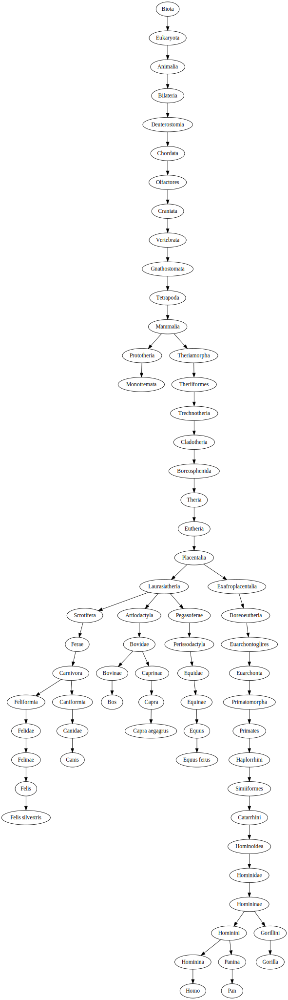

# Related how?

Once you've set this app up and imported and processed the data you can use the command line to get a little tree for two species:

```
> python related_how_graph.py "Homo sapiens" "Pan troglodytes" "Gorilla gorilla" "Canis lupus" "Capra aegagrus hircus" "Equus ferus caballus" "Bos taurus" "Felis silvestris catus" "Tachyglossidae"
```



# Setup

1. Set up a database. By default this app is configured to mysql on localhost with default username/password.
2. run `import_and_process.py`. This will take a long while, so keep calm!
3. run `fix_ambigious_parents.py` a few times until it only gives you warnings, and not any lines that look like "<specie> 12 -> 13"
